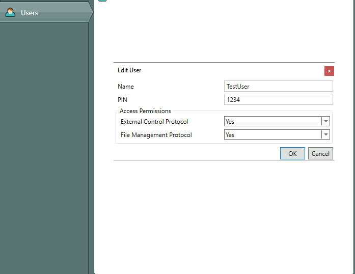
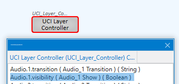

# Description

> This is a nodeJS tool for uploading code (or component changes) to your Q-Sys core from your IDE

## Installation

```bash
npm install ide_qsys
```

## Add dependency

```js
const Core = require("ide_qsys");
//or with es6:
import Core from "ide_qys"
```

## Initialize new core instance

> this takes an object with 4 arguments

```js
let deployment = new Core({
  ip: "192.168.1.1", //ip address of core
  username: "TestUser", //if authenticated, username
  pw: 1234, //if authenticated, pin number
  comp: "TextController" //component name of code you're updating
})
```

## Authentication

Your Q-Sys core might be hardened with authentication for QRC.
> [!WARNING]
> this is separate from authenticaion on the core itself

Authentication is performed in Q-Sys Administator:


## Add arguments after initializing

> add function will add or modify argruments after initializing

```js
let deployment = new Core();

deployment.ip = "192.168.1.1";
deployment.username = "TestUser";
...etc

console.log(deployment);
```

## Push code to the core

create .lua file

```bash
touch updateMe.lua
```

add code to .lua file

```lua
print("this is me adding code")
```

use `update()` to update:

```js
deployment.update('updateMe.lua')
```

... plus 2 optional arguments:

```js
let options = {
  id: 5678, //if not specified, id is 1234
  type: //default is code, but possible to add any control
}
```

if you add an options.type, then the first argument has to be the value you are changing the component type to:

```js
 deployment.update(true, {type: "Audio.1.visibility"})
```


