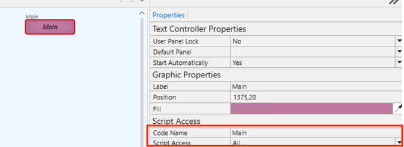
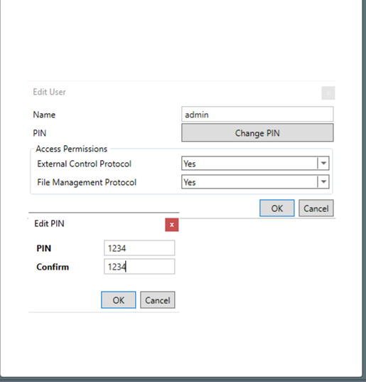

# ide_qsys

A Node.js library for programmatically managing Q-SYS cores and Lua scripts. Deploy code to multiple systems, monitor script health, sync with files, and automate your Q-SYS infrastructure.

## Installation

```bash
npm install ide_qsys
```

## Quick Start

### Basic Connection

```javascript
import Core from 'ide_qsys';

const { username, pin } = process.env;

const core = new Core({
  ip: '192.168.1.100',
  username,
  pin,
  verbose: false  // Enable verbose logging (default: false)
});

await core.connect();
const components = await core.getComponents();
console.log(`Found ${components.length} components`);
await core.disconnect();
```

## Q-SYS Component Configuration

Before you can access script components via QRC, they must be configured for script access in Q-SYS Designer.

### Enabling Script Access

In Q-SYS Designer, for each script component you want to access:

1. Select the script component
2. In the Properties panel, set **"Script Access"** dropdown to anything other than **"None"** (which is the default)
3. The **"Code Name"** field shows the component name you'll use in your code



**Important Notes:**
- **Script Access = "None"**: Component cannot be accessed via QRC
- **Script Access = "All"** or other options: Component can be accessed via QRC
- The **"Code Name"** field value is what you use as the `componentName` parameter in your API calls

```javascript
// If your component's "Code Name" is "Main"
const components = await core.getComponents();
const code = await core.getCode('Main');  // Use the Code Name here
```

## Authentication

### Setting Up Q-SYS Administrator Credentials

The username and PIN are configured in Q-SYS Administrator. You need to create a user with External Control Protocol permissions:



In Q-SYS Administrator:
1. Go to the user management section
2. Create or edit a user (e.g., "admin")
3. Set a PIN (e.g., "1234")
4. Enable "External Control Protocol" permissions
5. Enable "File Management Protocol" if you need file operations

### Constructor Options

```javascript
const { username, pin } = process.env;

const core = new Core({
  ip: '192.168.1.100',           // Required: Q-SYS Core IP address
  username,                      // Required: Username from Q-SYS Administrator
  pin,                          // Required: PIN (also accepts 'password' or 'pw')
  comp: 'Main',                 // Optional: Default component name
  verbose: false                // Optional: Enable debug logging
});
```

### Authentication Error Examples

**Wrong credentials:**
```javascript
// This will throw an error
const { username } = process.env;
const core = new Core({
  ip: '192.168.1.100',
  username,
  pin: 'wrong_pin'  // Intentionally wrong PIN for demonstration
});

try {
  await core.connect();
} catch (error) {
  console.error(error.message); // "QRC authentication failed for 192.168.1.100: Logon required"
}
```

**Missing credentials:**
```javascript
// This will throw an error
const core = new Core({
  ip: '192.168.1.100'
  // Missing username and pin
});

try {
  await core.connect();
} catch (error) {
  console.error(error.message); // "QRC authentication failed for 192.168.1.100: Logon required"
}
```

## Connection Management

### Session-Based (Recommended for Multiple Operations)

```javascript
const { username, pin } = process.env;
const core = new Core({ ip: '192.168.1.100', username, pin });

await core.connect();
// Perform multiple operations efficiently
const components = await core.getComponents();
const logs = await core.collectLogs('Main');
const code = await core.getCode('Main');
await core.disconnect();
```

### Single-Shot Operations (Auto Connect/Disconnect)

```javascript
const { username, pin } = process.env;
const core = new Core({ ip: '192.168.1.100', username, pin });

// These methods handle connection automatically
const components = await core.getComponentsSync();
const errors = await core.getScriptErrorsSync();
```

## API Reference

### Connection Methods

#### `connect()`
Establishes a persistent connection to the Q-SYS core.

```javascript
await core.connect();
```

#### `disconnect()`
Closes the connection to the Q-SYS core.

```javascript
const disconnected = await core.disconnect();
console.log(`Successfully disconnected: ${disconnected}`); // true if successful

// Check connection status anytime
console.log(`Currently connected: ${core.connected}`); // boolean property
```

**Returns:** `boolean` - `true` if successfully disconnected, `false` otherwise

### Component Methods

#### `getComponents()` / `getComponentsSync()`
Returns an array of all components in the Q-SYS design.

```javascript
// Session-based
await core.connect();
const components = await core.getComponents();
await core.disconnect();

// Single-shot
const components = await core.getComponentsSync();
```

**Returns:** Array of component objects with `Name` and `Type` properties.

#### `getControls(componentName, callback)` / `getControlsSync(componentName)`
Gets all controls for a specific component.

```javascript
// Session-based with callback
await core.connect();
await core.getControls('Main', (error, controls) => {
  if (error) console.error(error);
  else console.log(controls);
});
await core.disconnect();

// Single-shot
const controls = await core.getControlsSync('Main');
```

**Parameters:**
- `componentName` (string): Name of the component
- `callback` (function, optional): Callback function for session-based method

**Returns:** Array of control objects.

#### `getComponent(componentName, controlName, callback)` / `getComponentSync(componentName, controlName)`
Gets the value of a specific control.

```javascript
// Session-based
await core.connect();
const value = await core.getComponent('Main', 'Status');
await core.disconnect();

// Single-shot
const value = await core.getComponentSync('Main', 'Status');
```

**Parameters:**
- `componentName` (string): Name of the component
- `controlName` (string): Name of the control
- `callback` (function, optional): Callback function for session-based method

**Returns:** Control value object.

#### `setComponent(componentName, controlName, value, callback)` / `setComponentSync(componentName, controlName, value)`
Sets the value of a specific control.

```javascript
// Session-based
await core.connect();
await core.setComponent('Main', 'reload', 1);
await core.disconnect();

// Single-shot
await core.setComponentSync('Main', 'reload', 1);
```

**Parameters:**
- `componentName` (string): Name of the component
- `controlName` (string): Name of the control
- `value` (any): Value to set
- `callback` (function, optional): Callback function for session-based method

### Script Management Methods

#### `getScriptErrors(options, callback)` / `getScriptErrorsSync(options)`
Gets script errors for components with enhanced feedback.

```javascript
// Session-based - specific component
await core.connect();
const errors = await core.getScriptErrors({ scriptName: 'Main' });
console.log(errors.Found);    // true/false - component exists
console.log(errors.Message);  // descriptive message
console.log(errors.Value);    // error count (0 if no errors)

// Session-based - all components
const allErrors = await core.getScriptErrors();
console.log(allErrors.summary.totalScriptComponents);  // total script components found
console.log(allErrors.summary.componentsWithErrors);   // how many have errors
console.log(allErrors.errors);                         // array of components with errors

await core.disconnect();

// Single-shot
const errors = await core.getScriptErrorsSync({ scriptName: 'Main' });
```

**Parameters:**
- `options` (object, optional):
  - `scriptName` (string): Specific script name to check
- `callback` (function, optional): Callback function for session-based method

**Returns:** 
- With `scriptName`: Object with `Found`, `Message`, `Value`, `Details`, `Component` properties
- Without `scriptName`: Object with `errors` array and `summary` object

#### `restartScript(componentName, callback)` / `restartScriptSync(componentName)`
Restarts a script component.

```javascript
// Session-based
await core.connect();
await core.restartScript('Main');
await core.disconnect();

// Single-shot
await core.restartScriptSync('Main');
```

**Parameters:**
- `componentName` (string): Name of the script component
- `callback` (function, optional): Callback function for session-based method

#### `collectLogs(componentName, callback)` / `collectLogsSync(componentName)`
Collects console logs from a script component.

```javascript
// Session-based
await core.connect();
const logs = await core.collectLogs('Main');
await core.disconnect();

// Single-shot
const logs = await core.collectLogsSync('Main');
```

**Parameters:**
- `componentName` (string): Name of the script component
- `callback` (function, optional): Callback function for session-based method

**Returns:** Array of log strings with timestamps removed.

### Code Management Methods

#### `getCode(componentName, callback)` / `getCodeSync(componentName)`
Gets the Lua code from a script component.

```javascript
// Session-based
await core.connect();
const code = await core.getCode('Main');
await core.disconnect();

// Single-shot
const code = await core.getCodeSync('Main');
```

**Parameters:**
- `componentName` (string): Name of the script component
- `callback` (function, optional): Callback function for session-based method

**Returns:** String containing the Lua code.

#### `updateCode(componentName, code, callback)`
Updates the Lua code in a script component and returns deployment information.

```javascript
await core.connect();
const result = await core.updateCode('Main', luaCode);
console.log(`Errors: ${result.deployment.errorCount}`);
console.log(`Logs: ${result.deployment.logs.join(', ')}`);
await core.disconnect();
```

**Parameters:**
- `componentName` (string): Name of the script component
- `code` (string): Lua code to deploy
- `callback` (function, optional): Callback function

**Returns:** Object with deployment information including:
- `deployment.componentName` (string): Component name
- `deployment.codeLength` (number): Length of deployed code
- `deployment.errorCount` (number): Number of errors after deployment
- `deployment.errorDetails` (object): Error details if any
- `deployment.logs` (array): Console logs after deployment
- `deployment.timestamp` (string): Deployment timestamp

## Production Methods

### Multi-Core Deployment

#### `Core.deployToMultipleCores(coreConfigs, componentName, code, options)`
Static method to deploy one script to multiple Q-SYS cores.

```javascript
const { username, pin } = process.env;

const coreConfigs = [
  { ip: '192.168.1.100', username, pin, systemName: 'Core1' },
  { ip: '192.168.1.101', username, pin, systemName: 'Core2' },
  { ip: '192.168.1.102', username, pin, systemName: 'Core3' }
];

const result = await Core.deployToMultipleCores(
  coreConfigs,
  'Main',
  fs.readFileSync('./scripts/main.lua', 'utf8'),
  { validateFirst: true, rollbackOnError: true }
);
```

**Parameters:**
- `coreConfigs` (array): Array of core configuration objects
- `componentName` (string): Name of the script component
- `code` (string): Lua code to deploy
- `options` (object, optional):
  - `validateFirst` (boolean): Validate code before deployment
  - `rollbackOnError` (boolean): Rollback on deployment errors

**Returns:** Object with deployment results for each core.

### File Operations

#### `loadScriptFromFile(filePath, componentName, options)`
Loads Lua code from a file and deploys it to a component.

```javascript
await core.connect();
const result = await core.loadScriptFromFile('./scripts/main.lua', 'Main');
console.log(`Deployed: ${result.codeLength} characters, ${result.errorCount} errors`);
await core.disconnect();
```

**Parameters:**
- `filePath` (string): Path to the Lua file
- `componentName` (string): Name of the script component
- `options` (object, optional): Additional options

**Returns:** Object with deployment information.

#### `saveScriptToFile(componentName, filePath, options)`
Saves Lua code from a component to a file.

```javascript
await core.connect();
await core.saveScriptToFile('Main', './backup/main.lua', {
  createDir: true,
  backup: true
});
await core.disconnect();
```

**Parameters:**
- `componentName` (string): Name of the script component
- `filePath` (string): Path where to save the file
- `options` (object, optional):
  - `createDir` (boolean): Create directory if it doesn't exist
  - `backup` (boolean): Create backup if file exists

#### `syncScriptWithFile(componentName, filePath, direction, options)`
Synchronizes a script component with a file.

```javascript
await core.connect();

// Check sync status without making changes
const status = await core.syncScriptWithFile('Main', './scripts/main.lua', 'check');
console.log(status.message); // "File (3252 chars) and component (3232 chars) differ"

// Force file to component
await core.syncScriptWithFile('Main', './scripts/main.lua', 'push', {
  createBackup: true  // Create backup before overwriting (default: true)
});

// Force component to file
await core.syncScriptWithFile('Main', './scripts/main.lua', 'pull', {
  createBackup: true  // Create backup before overwriting (default: true)
});

await core.disconnect();
```

**Parameters:**
- `componentName` (string): Name of the script component
- `filePath` (string): Path to the file
- `direction` (string): 'check', 'push', or 'pull'
- `options` (object, optional):
  - `createBackup` (boolean): Create backup files before overwriting (default: true)

**Directions:**
- `'check'`: Compare file and component, return status information
- `'push'`: Update component with file content (file → component)
- `'pull'`: Update file with component content (component → file)

**Returns:** Object with sync information:
- `success` (boolean): Operation success status
- `action` (string): 'check', 'push', or 'pull'
- `direction` (string): Sync direction used (for push/pull)
- `message` (string): Descriptive status message
- `inSync` (boolean): Whether file and component are identical (check only)
- `status` (string): Sync status - 'in-sync', 'out-of-sync', 'file-missing', 'component-missing', 'both-missing' (check only)
- `fileSample` (string): First 100 characters of file (check only, when different)
- `componentSample` (string): First 100 characters of component (check only, when different)
- `codeLength` (number): Length of synced code (push/pull only)
- `backupPath` (string): Path to backup file if created (pull only)

#### `backupAllScripts(backupDir, options)`
Backup all control scripts from the system to a designated folder.

```javascript
const { username, pin } = process.env;
const core = new Core({ ip: '192.168.1.100', username, pin });

await core.connect();

// Auto-generated backup directory (default - no timestamp, will overwrite)
const result = await core.backupAllScripts();
// Creates: ./backup_192-168-1-100/

// Auto-generated with timestamp (prevents overwrites)
const result = await core.backupAllScripts(null, { timestamp: true });
// Creates: ./backup_192-168-1-100_2025-11-05T17-33-26-480Z/

// Specific backup directory
const result = await core.backupAllScripts('./backups/core1');

// Advanced backup with options
const result = await core.backupAllScripts('./backups/core1', {
  createDir: true,        // Create directory if it doesn't exist (default: true)
  includeEmpty: false,    // Include scripts with empty code (default: false)
  systemName: 'Core1',    // Custom system name for manifest (default: IP)
  timestamp: false        // Include timestamp in auto-generated directory names (default: false)
});

console.log(`Backed up ${result.scriptCount} scripts to ${result.backupDir}`);
console.log(`Scripts: ${result.scripts.join(', ')}`);

await core.disconnect();
```

**Parameters:**
- `backupDir` (string, optional): Directory path where scripts will be saved (default: auto-generated folder)
- `options` (object, optional):
  - `createDir` (boolean): Create backup directory if it doesn't exist (default: true)
  - `includeEmpty` (boolean): Include scripts with empty/blank code (default: false)
  - `systemName` (string): Custom system name for manifest (default: uses systemName or IP)
  - `timestamp` (boolean): Include timestamp in auto-generated directory names (default: false)

**Returns:** Object with backup information:
- `success` (boolean): Backup operation success status
- `backupDir` (string): Path to backup directory
- `scriptCount` (number): Number of scripts backed up
- `totalComponents` (number): Total components found in system
- `manifest` (string): Path to backup manifest file
- `scripts` (array): Array of script names that were backed up

**Files Created:**
- `{ComponentName}.lua` - Individual script files
- `backup_manifest.json` - Backup metadata and script inventory

### Health Monitoring

#### `Core.monitorScriptHealth(coreConfigs, scriptNames, options)`
Static method to monitor script health across multiple cores.

```javascript
const { username, pin } = process.env;

const coreConfigs = [
  { ip: '192.168.1.100', username, pin, systemName: 'Core1' },
  { ip: '192.168.1.101', username, pin, systemName: 'Core2' },
  { ip: '192.168.1.102', username, pin, systemName: 'Core3' }
];

const healthReport = await Core.monitorScriptHealth(
  coreConfigs,
  ['Main', 'Module'],
  {
    includeErrors: true,
    includeStatus: true,
    includeLogs: true,
    logLines: 5
  }
);

console.log(`Overall health: ${healthReport.summary.healthPercentage}%`);
console.log(`Cores with issues: ${healthReport.summary.coresWithIssues}`);
```

**Parameters:**
- `coreConfigs` (array): Array of core configuration objects
- `scriptNames` (array): Array of script names to monitor
- `options` (object, optional):
  - `includeErrors` (boolean): Include error information
  - `includeStatus` (boolean): Include status information
  - `includeLogs` (boolean): Include log information
  - `logLines` (number): Number of log lines to include

**Returns:** Object with health report and summary.

## Best Practices

1. **Always disconnect**: Ensure sessions are properly closed
2. **Use try/finally**: Guarantee cleanup even on errors
3. **Batch operations**: Use sessions for multiple operations
4. **Single-shot for simple tasks**: Use sync methods for one-off operations

```javascript
const { username, pin } = process.env;
const core = new Core({ ip: '192.168.1.100', username, pin });

try {
  await core.connect();
  
  // Multiple operations
  const components = await core.getComponents();
  const errors = await core.getScriptErrors();
  const logs = await core.collectLogs('Main');
  
} catch (error) {
  console.error('Session operations failed:', error);
} finally {
  await core.disconnect(); // Always cleanup
}
```

## Requirements

- Node.js 14+ (ES modules support)
- Q-SYS Core with QRC enabled
- Network access to Q-SYS Core on port 1710

## License

ISC

## Contributing

Issues and pull requests welcome at [GitHub repository](https://github.com/patrickgilsf/ide_qsys).